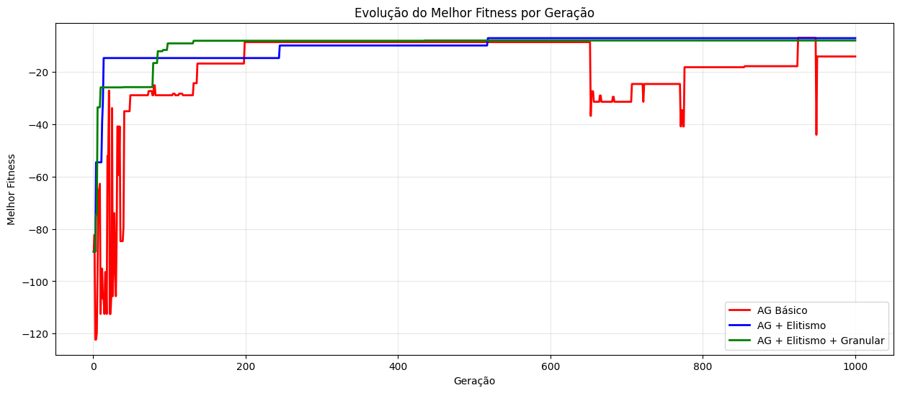

# Tech Challenge - 5IADT - Fase 2

## 🎯 Descrição do Problema

Este projeto aborda a **otimização de cardápios nutricionais** usando algoritmos genéticos, onde o objetivo é encontrar combinações de alimentos que minimizem o desvio das metas nutricionais estabelecidas.

### Desafio

- Selecionar alimentos da base [TACO (Tabela Brasileira de Composição de Alimentos) - UNICAMP](https://www.gov.br/agricultura/pt-br/assuntos/inspecao/produtos-vegetal/legislacao-de-produtos-origem-vegetal/biblioteca-de-normas-vinhos-e-bebidas/tabela-brasileira-de-composicao-de-alimentos_taco_2011.pdf)
- Combinar 3 alimentos por refeição em cardápios de 3 refeições diárias
- Otimizar simultaneamente 4 parâmetros: energia, proteína, carboidratos e lipídeos

### Metas Nutricionais

| Nutriente   | Meta Diária |
| ----------- | ----------- |
| Energia     | 2000 kcal   |
| Carboidrato | 275g        |
| Proteína    | 75g         |
| Lipídeos    | 70g         |

## 🧬 Implementação

### Representação Genética

- **Gene**: Alimento específico (ex: "Arroz, tipo 1, cozido")
- **Cromossomo**: Refeição com 3 alimentos
- **Indivíduo**: Cardápio completo (café da manhã, almoço, jantar)

### Algoritmo Genético

**Função de Fitness**

```python
fitness = -Σ|valor_atual - meta| para todos os nutrientes
```

**Operadores Implementados**

- **Seleção**: Torneio (k=3)
- **Cruzamento**: Herança completa de refeições entre pais
- **Mutação**: Por refeição completa ou por alimento individual
- **Elitismo**: Preserva 10% dos melhores indivíduos

### Variações Testadas

| Variação                     | Elitismo | Mutação      | Objetivo                                                         |
| ---------------------------- | -------- | ------------ | ---------------------------------------------------------------- |
| **AG Básico**                | ❌       | Por refeição | Explorar amplamente o espaço de soluções sem preservar histórico |
| **AG + Elitismo**            | ✅       | Por refeição | Preservar as melhores soluções encontradas, evitando perdas      |
| **AG + Elitismo + Granular** | ✅       | Por alimento | Realizar ajustes finos e incrementais nas melhores soluções      |

## 📊 Resultados

### Parâmetros de Teste

```python
POPULACAO = 30 | GERACOES = 1000 | MUTACAO = 50% | ELITISMO = 10%
```

### Performance dos Algoritmos

| Algoritmo                    | Energia (kcal) | Carboidrato (g) | Proteína (g) | Lipídeos (g) | Fitness |
| ---------------------------- | -------------- | --------------- | ------------ | ------------ | ------- |
| **AG Básico**                | 0.00           | -9.50           | +2.00        | +2.70        | -14.20  |
| **AG + Elitismo**            | -1.00          | +0.80           | -4.80        | -0.60        | -7.20   |
| **AG + Elitismo + Granular** | 0.00           | -0.80           | -2.00        | +5.30        | -8.10   |

### Gráfico



## 🔬 Conclusão

### Eficácia dos Algoritmos Genéticos

Os resultados demonstram que **algoritmos genéticos são altamente eficazes** para otimização nutricional, atingindo **>92% de precisão** em todos os nutrientes com convergência consistente.

### Insights

- **Aleatoriedade como característica**: A natureza estocástica dos AGs significa que diferentes execuções podem favorecer estratégias distintas
- **Elitismo como estabilizador**: Apesar da variabilidade, o elitismo oferece consistência na preservação de boas soluções
- **Estratégias de mutação distintas**: Mutação granular produz melhorias pequenas e frequentes, enquanto mutação agressiva gera saltos maiores porém menos frequentes
- **Complementaridade de estratégias**: Combinações híbridas (elitismo + mutação granular) podem ser vantajosas para aplicações práticas

## 🛠️ Execução

### Tecnologias

- **Python 3.8+** | **Pandas** | **Matplotlib** | **Jupyter Notebook**

### Estrutura

```
IADT-Fase-2/
├── IADT_Fase_2.ipynb     # Implementação dos algoritmos
├── alimentos.csv         # Base TACO 2011
├── requirements.txt      # Dependências
└── README.md             # Documentação
```

### Como Executar

```bash
# Instalar dependências
pip install -r requirements.txt

# Executar notebook
jupyter notebook IADT_Fase_2.ipynb
```
